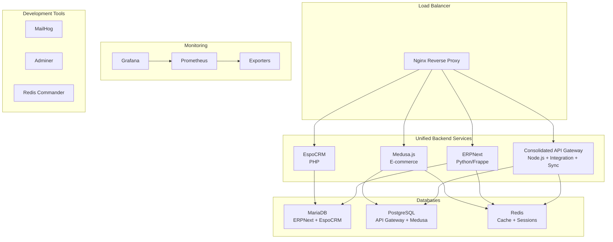

# Harsha Delights Confectionery System - Docker Development Environment

This repository contains a unified confectionery business management system for Harsha Delights. The system features a consolidated backend architecture with integrated business operations, real-time synchronization, and micro-frontend applications for different user segments.

## 🏗️ Architecture Overview



## 🚀 Quick Start

### Prerequisites

- Docker Engine 20.0+
- Docker Compose 2.0+
- At least 8GB RAM
- 20GB free disk space

### 1. Clone and Setup

```bash
# Clone the repository
git clone <repository-url>
cd harshadelights

# Copy environment file and configure
cp .env.example .env
# Edit .env with your specific values
```

### 2. Start the Development Environment

```bash
# Start all services
docker-compose up -d

# Monitor the startup process
docker-compose logs -f

# Check service health
docker-compose ps
```

### 3. Initialize the System

```bash
# Run the initialization script
./scripts/init-dev-environment.sh

# Or manually initialize each service
docker-compose exec erpnext bench --site harshadelights.local install-app harsha_customizations
docker-compose exec medusa npm run seed
```

## 📋 Services Overview

| Service | Port | URL | Description |
|---------|------|-----|-------------|
| **Nginx** | 80, 443 | http://localhost | Reverse proxy and load balancer |
| **Consolidated API Gateway** | 4000 | http://localhost:4000 | Unified backend (API + Integration + Sync) |
| **ERPNext** | 8000 | http://localhost/erpnext | ERP and business management |
| **Medusa** | 9000 | http://localhost/store | E-commerce backend |
| **Medusa Admin** | 7000 | http://localhost/admin | E-commerce admin interface |
| **EspoCRM** | 8080 | http://localhost/crm | Customer relationship management |
| **Grafana** | 3001 | http://localhost:3001 | Monitoring dashboards |
| **Prometheus** | 9090 | http://localhost:9090 | Metrics collection |
| **MailHog** | 8025 | http://localhost:8025 | Email testing |
| **Adminer** | 8081 | http://localhost:8081 | Database administration |
| **Redis Commander** | 8082 | http://localhost:8082 | Redis management |

## 🗄️ Database Configuration

### MariaDB (ERPNext & EspoCRM)
- **Host**: mariadb:3306
- **Databases**: `erpnext_hd`, `espocrm_hd`
- **User**: `erpnext` / `espocrm_user`
- **Admin Tool**: Adminer at http://localhost:8081

### PostgreSQL (Consolidated Backend & Medusa)
- **Host**: postgres:5432
- **Databases**: `harsha_delights` (unified), `harsha_medusa`
- **User**: `harsha_admin`
- **Note**: Now uses connection pooling for optimized resource management
- **Admin Tool**: Adminer at http://localhost:8081

### Redis (Caching & Sessions)
- **Host**: redis:6379
- **Databases**: 0-15 (allocated for different services)
- **Admin Tool**: Redis Commander at http://localhost:8082

## 🔧 Development Workflow

### Starting Development

```bash
# Start development environment
docker-compose up -d

# Watch logs for all services
docker-compose logs -f

# Watch logs for specific service
docker-compose logs -f api-gateway
```

### Making Code Changes

The development environment is configured with hot reload:

- **Consolidated Backend**: Changes in `./api-gateway/` auto-reload (includes Integration + Sync services)
- **ERPNext**: Custom apps in `./erpnext_customizations/` require restart
- **Medusa**: Changes in `./ecommerce-backend/` auto-reload

### Database Operations

```bash
# Access MariaDB
docker-compose exec mariadb mysql -u root -p

# Access PostgreSQL
docker-compose exec postgres psql -U harsha_admin -d harsha_delights_gateway

# Backup databases
docker-compose exec backup /scripts/backup-databases.sh

# Restore from backup
docker-compose exec backup /scripts/restore-databases.sh <backup-file>
```

### Debugging Services

```bash
# Shell access to containers
docker-compose exec api-gateway /bin/sh
docker-compose exec erpnext /bin/bash
docker-compose exec medusa /bin/sh

# Check service health
curl http://localhost:4000/health  # Consolidated Backend (API + Integration + Sync)
curl http://localhost:8000         # ERPNext
curl http://localhost:9000/health  # Medusa
```

## 📊 Monitoring and Observability

### Metrics and Dashboards

- **Grafana**: http://localhost:3001 (admin/grafana_admin_2024)
  - System metrics dashboard
  - Application performance dashboard
  - Business metrics dashboard
  - Database monitoring dashboard

- **Prometheus**: http://localhost:9090
  - Raw metrics and alerting rules
  - Service discovery and targets

### Log Management

```bash
# View service logs
docker-compose logs -f [service-name]

# Aggregate logs from all services
docker-compose logs -f | grep ERROR

# Export logs for analysis
docker-compose logs --no-color > system-logs.txt
```

### Health Monitoring

```bash
# Check all service health
./scripts/health-check.sh

# Monitor resource usage
docker stats

# Check disk usage
docker system df
```

## 🔒 Security Configuration

### Environment Variables

Critical security settings in `.env`:

```bash
# Database passwords
MARIADB_ROOT_PASSWORD=<strong-password>
POSTGRES_PASSWORD=<strong-password>

# API keys and secrets
JWT_SECRET=<256-bit-key>
API_ENCRYPTION_KEY=<32-char-key>

# Service passwords
ERPNEXT_ADMIN_PASSWORD=<strong-password>
GRAFANA_ADMIN_PASSWORD=<strong-password>
```

### Network Security

- All services run in isolated Docker network
- Database ports not exposed externally
- SSL/TLS configured for production
- Rate limiting enabled on API Gateway

### Access Control

- Role-based access in ERPNext and EspoCRM
- JWT authentication in API Gateway
- Database user isolation
- Monitoring access controls

## 🚀 Production Deployment

### Environment Preparation

1. **Update environment variables** for production
2. **Enable SSL certificates** in Nginx configuration
3. **Configure external databases** if needed
4. **Set up monitoring alerts**
5. **Configure backup storage** (S3/cloud)

### Production Checklist

- [ ] SSL certificates configured
- [ ] Production passwords set
- [ ] Database backups automated
- [ ] Monitoring alerts configured
- [ ] Log aggregation set up
- [ ] Security scanning completed
- [ ] Performance testing done
- [ ] Disaster recovery plan documented

## 🛠️ Troubleshooting

### Common Issues

#### Services Won't Start

```bash
# Check Docker daemon
docker version

# Check compose file syntax
docker-compose config

# Check resource usage
docker system df
docker stats
```

#### Database Connection Issues

```bash
# Test database connectivity
docker-compose exec api-gateway curl -f postgres:5432
docker-compose exec api-gateway curl -f mariadb:3306

# Check database logs
docker-compose logs mariadb
docker-compose logs postgres
```

#### Memory Issues

```bash
# Increase Docker memory limit (Docker Desktop)
# Or adjust service memory limits in docker-compose.yml

# Monitor memory usage
docker stats --format "table {{.Container}}\t{{.CPUPerc}}\t{{.MemUsage}}"
```

### Performance Optimization

#### Database Tuning

- MariaDB: Adjust `innodb_buffer_pool_size` in `docker/mariadb/my.cnf`
- PostgreSQL: Tune `shared_buffers` in `docker/postgres/postgresql.conf`
- Redis: Configure memory limits in `docker/redis/redis.conf`

#### Application Scaling

```bash
# Scale specific services
docker-compose up -d --scale api-gateway=3
docker-compose up -d --scale erpnext-worker=2

# Load balancing handled by Nginx
```

## 📚 API Documentation

### Consolidated Backend Endpoints

**Core API Routes:**
- **Health**: `GET /health` - System health check
- **Metrics**: `GET /metrics` - Prometheus metrics
- **Ready**: `GET /ready` - Kubernetes readiness probe
- **Live**: `GET /live` - Kubernetes liveness probe

**Integrated Services:**
- **Integration**: `GET|POST /api/integration/*` - Business operations coordination
- **Sync**: `GET|POST /api/sync/*` - Real-time data synchronization
- **Authentication**: `POST /api/auth/*` - Unified authentication system

**Documentation:**
- **Swagger UI**: http://localhost:4000/api-docs
- **OpenAPI JSON**: http://localhost:4000/api-docs.json
- **Authentication**: `POST /auth/login`
- **ERPNext Proxy**: `/api/v1/erpnext/*`
- **Medusa Proxy**: `/api/v1/store/*`

### Integration APIs

- **ERPNext API**: http://localhost:8000/api/method/
- **Medusa Store API**: http://localhost:9000/store/
- **Medusa Admin API**: http://localhost:9000/admin/
- **EspoCRM API**: http://localhost:8080/api/v1/

## 🤝 Contributing

### Development Setup

1. Fork the repository
2. Create a feature branch
3. Make your changes
4. Test thoroughly
5. Submit a pull request

### Code Standards

- Follow existing code style
- Add tests for new features
- Update documentation
- Ensure Docker builds succeed

### Testing

```bash
# Run API tests
docker-compose exec api-gateway npm test

# Run ERPNext tests
docker-compose exec erpnext bench --site harshadelights.local run-tests

# Run integration tests
./scripts/run-integration-tests.sh
```

## 📄 License

This project is licensed under the MIT License - see the LICENSE file for details.

## 🆘 Support

For support and questions:

- Create an issue in the repository
- Check the troubleshooting section
- Review the logs for error messages
- Contact the development team

## 🔄 Updates and Maintenance

### Regular Maintenance

```bash
# Update Docker images
docker-compose pull

# Clean up unused resources
docker system prune -a

# Update application dependencies
docker-compose exec api-gateway npm update
docker-compose exec medusa npm update
```

### Backup and Recovery

```bash
# Manual backup
docker-compose exec backup /scripts/backup-daemon.sh backup full

# Scheduled backups run automatically via cron
# Check backup status
docker-compose exec backup ls -la /backups/
```

---

**Harsha Delights Development Team**
For technical support: support@harshadelights.com